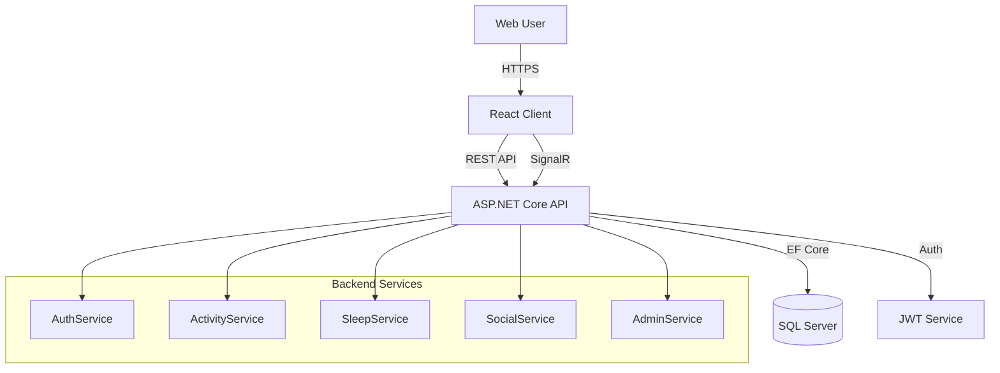
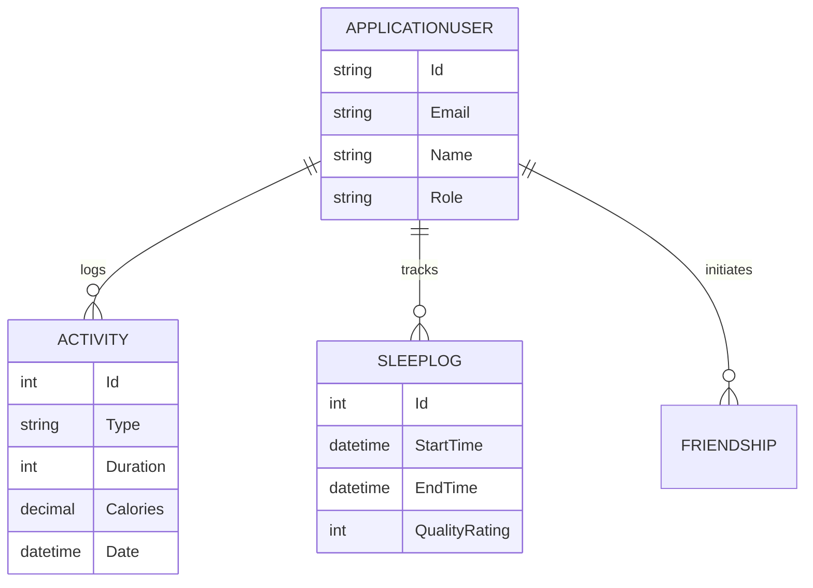

# HealthFitness System Documentation

**Version:** 1.0
**Date:** December 13, 2025
**Author:** HealthFitness Dev Team

---

## 1. System Overview

HealthFitness is a modern, full-stack application designed to help users track their physical activities, nutrition, sleep, and social interactions. The system is built on a **Service-Oriented Architecture** (SOA) with a clear separation between the .NET Core Backend and the React Frontend.

### 1.1 Architecture Diagram

---

## 2. Technical Specifications

### 2.1 Backend (API)
-   **Framework:** ASP.NET Core 8 Web API
-   **Database ORM:** Entity Framework Core 8
-   **Authentication:** JWT (JSON Web Tokens) with Policy-Based Authorization (PBAC).
-   **Real-Time:** SignalR (for instant notifications).

### 2.2 Frontend (Client)
-   **Framework:** React 18 (Vite build tool)
-   **Styling:** Tailwind CSS (Utility-first framework)
-   **State Management:** React Context API (`AuthContext`, `LanguageContext`)
-   **Routing:** React Router DOM v6

### 2.3 Database Schema (Key Entities)

---

## 3. User Roles & Capabilities

The system controls access through two primary roles:

### 3.1 Standard User
The default role for new registrations.
-   **Dashboard:** View personal summaries (Recent Activity, Sleep Avg).
-   **My Activities:** Log new workouts, edit history, delete own logs.
-   **Social:**
    -   Participate in the **Weekly Leaderboard**.
    -   View **Activity Feed** of friends.
    -   Send/Accept Friend Requests.
-   **Sleep:** Log sleep sessions and view quality trends.
-   **Restrictions:** Cannot viewing system-wide data or other users' private logs.

### 3.2 Administrator
A privileged role for system management.
-   **System Feed:** View a read-only stream of **ALL** activities from **ALL** users (System Monitoring).
-   **User Management:**
    -   View list of all registered users.
    -   **Suspend/Ban**: Revoke login access for specific users.
    -   **Activate**: Restore access.
-   **Restrictions:**
    -   Cannot log personal data (Sleep/Activities) to maintain role separation.
    -   Cannot delete user data directly from the system feed (security measure).

---

## 4. Feature Guide

### 4.1 Social Leaderboard
The leaderboard is calculated dynamically based on **Total Calories Burned** in the current week (Monday to Sunday).
-   **Update Frequency:** Real-time (instant updates when activities are logged).
-   **Privacy:** Only shows user name and total score.

### 4.2 Activity Logging
Users can log various types of activities:
-   Running, Cycling, Swimming, Weight Training, Yoga.
-   **Metrics:** Duration (minutes), Calories (kcal), Distance (km).

### 4.3 Sleep Tracking
A dedicated module for sleep hygiene.
-   **Input:** Bed Time vs. Wake Up Time.
-   **Validation:** System prevents Wake Time < Bed Time.
-   **Quality:** 1 (Poor) to 5 (Excellent) subjective rating.

---

## 5. API Reference (Key Endpoints)

| Method | Endpoint | Role | Description |
| :--- | :--- | :--- | :--- |
| `POST` | `/api/auth/login` | Public | Authenticate and receive JWT. |
| `POST` | `/api/auth/register` | Public | Create a new account. |
| `GET` | `/api/activities` | User | Get personal activity history. |
| `POST` | `/api/activities` | User | Log a new activity. |
| `GET` | `/api/admin/activities` | Admin | Get system-wide activity log. |
| `GET` | `/api/admin/users` | Admin | Get all registered users. |
| `PUT` | `/api/admin/users/{id}/toggle-status` | Admin | Suspend/Activate a user. |
| `GET` | `/api/social/leaderboard` | User | Get weekly top list. |
| `GET` | `/api/social/feed` | User | Get friends' recent activities. |

---

## 6. Installation & Setup

1.  **Database**: Ensure SQL Server is running. The app will auto-create the DB `HealthFitnessDb` on startup.
2.  **Backend**: Open `HealthFitness.API` and run `dotnet run`.
3.  **Frontend**: Open `healthfitness-client` and run `npm run dev`.
4.  **Admin Login**: Use `admin@healthfitness.com` / `Admin@123`.

---
*Generated for HealthFitness Inc.*
